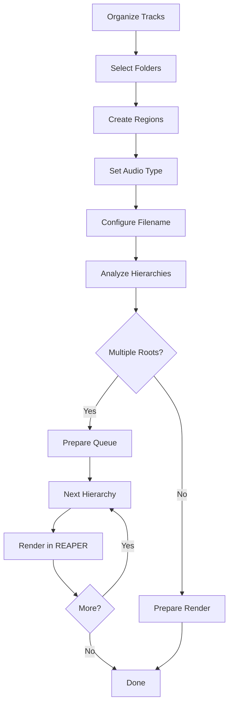
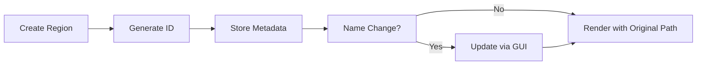
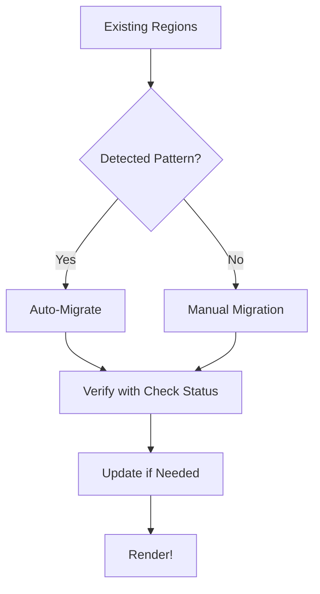

# 🎚️ SFX Renderer v2.2 - Professional Audio Rendering for REAPER

**Advanced hierarchical rendering solution with region tracking, ID-based metadata, and selective rendering**


## 🚀 Key Workflow Improvements
- **Region ID Tracking**: Persistent hierarchy metadata independent of region names
- **Selective Rendering**: Render single regions or entire projects
- **Dynamic Hierarchy Updates**: Modify folder structure after region creation
- **Enhanced Migration**: Convert existing regions while preserving relationships
- **Position-Based Identification**: Track regions by time position rather than names

## ⚡ Quick Start Guide

### 1. Installation
```bash
1. Download `SFX_Renderer_v2.2.lua`
2. Place in REAPER/Scripts directory
3. Run via: [Actions] > [Load ReaScript...]
```
### Prerequisites:

- REAPER 6.0 or higher

- ReaImGui extension (required for GUI functionality)

### 2. Core Workflow


## 🖥️ GUI Overview


## 🛠️ Enhanced Toolbox: Button Reference

### 🔨 Core Creation Tools
| Button | Function | New Features | Usage Example |
|--------|----------|--------------|---------------|
| **Create regions** | Generates regions with hierarchical metadata | Unique position-based ID | Create regions for `Ambient/Jungle` |
| **Render All Regions** | Renders all project regions | Maintains hierarchical structure | Export complete project |
| **Render Selected Region** | Renders only the selected region | Detects region under cursor or selected | Quick test render |
| **Update Hierarchy** | Updates hierarchy for renamed regions | Maintains folder-region relationship | Fix `env_Jungle` → Root:Ambient, Parent:Jungle |

### 📊 Advanced Hierarchy Management
| Button | Function | Technical Improvement | Use Case |
|--------|----------|-----------------------|----------|
| **Analyze Hierarchies** | Scans structure with persistent data | Works with renamed regions | Verify organization after changes |
| **Manual Migration** | Manually assigns hierarchy | Uses unique ID for persistent reference | Migrate regions with non-standard names |
| **Check Status** | Verifies hierarchical metadata | Detects regions without information | Validate project before render |

### ⚙️ Configuration Tools
| Button | Function | New Capability |
|--------|----------|----------------|
| **Browse Output Folder** | Select custom output folder | Persistence between sessions |
| **Clear Queue** | Reset rendering queue | Doesn't affect hierarchical data |

## 🌟 New Features in v2.2

### 🆔 Persistent Region Identification
```markdown
• Unique ID based on position/duration
• Survives name changes
• Example: "0.000000_5.250000" → Root:Ambient, Parent:Jungle
```

### 🎯 Selective Region Rendering
```markdown
1. Place cursor inside a region
2. Click "Render Selected Region"
3. System automatically:
   - Detects the region
   - Sets correct hierarchical path
   - Renders only that region
```

### 🔄 Dynamic Hierarchy Updates
```markdown
When renaming a region:
1. Select the region
2. Click "Update Hierarchy"
3. Enter new root/parent relationship
4. Data stored with unique ID
```

### 🧩 Enhanced Migration System
```markdown
• Extracts hierarchy from existing names
• Stores with unique ID (not name)
• Compatible with:
  - Renamed regions
  - Moved regions
  - Legacy projects
```

## 🔍 Deep Dive: Position-Based Identification

### How It Works


### Benefits
```markdown
• ✅ Rename regions without breaking hierarchies
• ✅ Move regions while maintaining relationships
• ✅ Migrate legacy projects easily
• ✅ Render selectively by region
```

## 🎚️ Audio Type Configuration

### Environment (New Optimization)
```markdown
Pattern: `env_$root_$parent_$region`
Example: `env_Ambient_Jungle_Night_01.wav`
Path: Renders/Environment/Ambient/Jungle/
```

### Enhanced SFX Workflow
```markdown
• Update Hierarchy: Maintains relationships after renaming
• Render Selected: Quick tests without processing everything
```

## 🛠️ Migration Workflow


## 📂 Output Structure
```markdown
Renders/
├── SFX/
│   ├── Weapons/
│   │   └── Pistol/ [shoot_01.wav, reload_02.wav]  # Renamed!
├── Environment/
│   ├── Ambient/
│   │   └── Jungle/ [night_ambience.wav]  # Updated!
└── Dialogue/
    └── NPC/
        └── Merchant/ [greeting.wav]  # Migrated!
```

## 💡 Pro Tips
1. **Dynamic Updates**: Use "Update Hierarchy" after reorganizing folders
2. **Partial Renders**: "Render Selected Region" for preliminary exports
3. **ID System**: Regions maintain their hierarchy even when you change names
4. **Migration First**: Always run "Migrate Existing Regions" on old projects
5. **Consistent Patterns**: Use the same wildcard pattern throughout the project

## 🐛 Troubleshooting Cheat Sheet
| Symptom | Solution |
|---------|----------|
| Region not detected | Verify cursor inside region or time selection |
| Hierarchy mismatch | Use "Update Hierarchy" to reassign |
| Migration fails | Try "Manual Migration" for problematic regions |
| Lost settings | Verify script in correct folder (REAPER/Scripts) |

## 🌐 Real-World Applications
| Scenario | Solution | Benefit |
|----------|----------|---------|
| **Renamed Regions** | Update Hierarchy | Maintains folder structure |
| **Partial Export** | Render Selected Region | Saves time in iterations |
| **Legacy Projects** | Migrate + Check Status | Modernizes old workflows |
| **Team Collaboration** | Consistent Wildcards | Standard across all assets |

---

**Version**: 2.2  
**Author**: Daniel "Panchuel" Montoya  
**Compatibility**: REAPER 6.0+  
**Last Updated**: July 2025  

> ⚠️ **Critical Note**: The new unique ID system requires:
> - Use "Update Hierarchy" if you move regions significantly
> - Run "Migrate Existing Regions" when opening old projects
> - Verify with "Check Status" before critical renders
