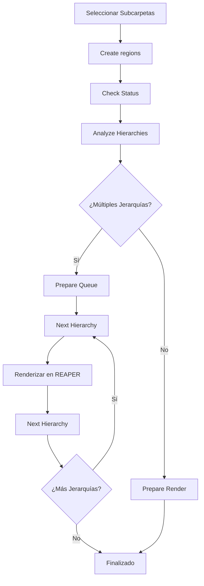
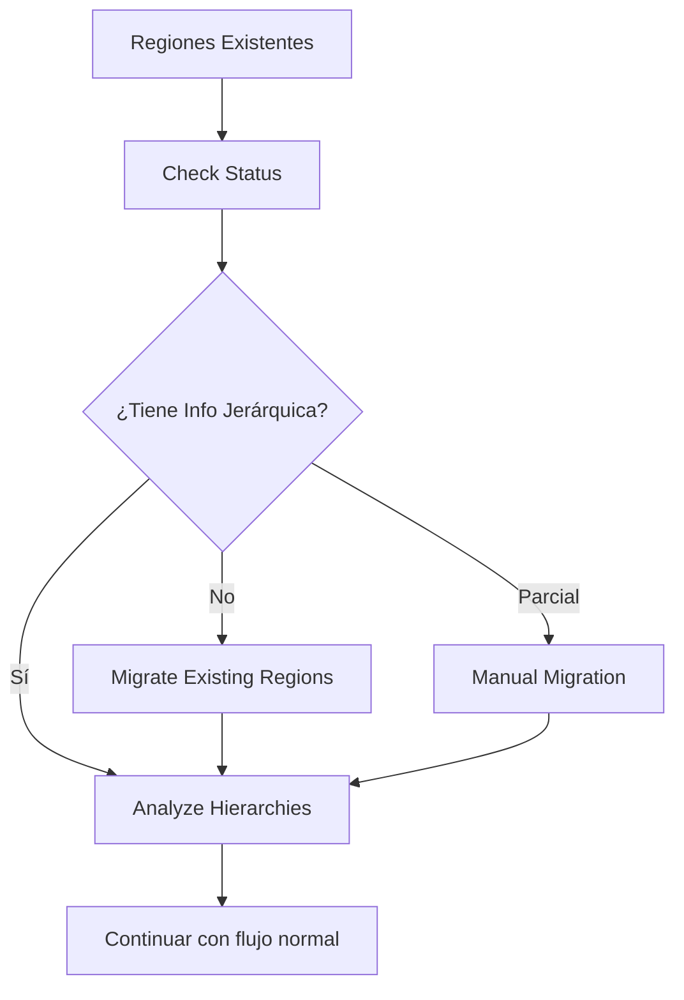

# SFX Renderer v2.1

**Renderizador SFX con jerarquía + GUI + Wildcards + Persistencia + Renderizado Manual por Jerarquías**

Un script avanzado para REAPER que automatiza la creación de regiones y el renderizado de archivos de audio organizados jerárquicamente, especialmente diseñado para proyectos de audio complejo con múltiples carpetas y estructuras.

## 🎯 Características Principales

- ✅ **Creación automática de regiones** desde subcarpetas
- ✅ **Detección de jerarquías múltiples** (FootSteps/Dirt + Weapons/Pistol)
- ✅ **Renderizado manual por jerarquías** para evitar conflictos de rutas
- ✅ **Soporte para variaciones** con parámetros aleatorios
- ✅ **Migración de regiones existentes** 
- ✅ **Múltiples tipos de archivo** (SFX, Music, Dialogue, Environment)
- ✅ **Wildcards personalizables** para nombres de archivo
- ✅ **Persistencia de configuración**
- ✅ **Interfaz gráfica intuitiva**

## 📋 Instalación

1. Descarga el archivo `SFX_Renderer_v2.1.lua`
2. Cópialo a tu carpeta de Scripts de REAPER
3. En REAPER: `Actions → Load ReaScript...`
4. Selecciona el archivo y cárgalo
5. Ejecuta el script desde Actions

## 🎮 Interfaz de Usuario


### **📊 Información de Tracks**
```
Selected tracks: 4
First track depth: 1
Detected root folder: FootSteps
```
- **Selected tracks:** Cantidad de tracks seleccionados
- **First track depth:** Profundidad del primer track (debe ser 1 para subcarpetas)
- **Detected root folder:** Carpeta raíz detectada automáticamente

### **🎵 Configuración de Tipo de Archivo**

#### **SFX (Sound Effects)**
- **Prefix:** Prefijo para nombres de región (ej: "sx")
- **Variations:** Número de variaciones por subcarpeta (0 = solo regiones)
- **Separation time:** Tiempo entre variaciones en segundos
- **Position randomization:** Aleatorización de posición temporal
- **Variation Parameters:** Parámetros de aleatorización (volumen, pan, pitch, etc.)

#### **Music**
- **BPM:** Tempo del proyecto
- **Meter:** Compás musical (ej: "4-4")

#### **Dialogue**
- **Character:** Nombre del personaje
- **Quest Type:** Tipo de misión (ej: "SQ", "HC")
- **Quest Name:** Nombre de la misión
- **Line Number:** Número de línea de diálogo

#### **Environment**
- Configuración automática para sonidos ambientales

### **🎯 Configuración de Archivos**

#### **Filename Pattern**
```
Wildcards disponibles:
• $root: Nombre de carpeta padre
• $parent: Nombre de subcarpeta
• $region: Nombre de región
• También cualquier wildcard de REAPER (ej: $track)
```

**Ejemplo:** `$region` produce → `sx_FootSteps_Dirt_01.wav`

#### **Output Folder**
- **Browse Output Folder:** Seleccionar carpeta de salida personalizada
- **Reset to Default:** Usar carpeta por defecto (Project/Renders/)

## 🔧 Botones y Funcionalidades

### **🏗️ Botones Principales**

#### **Create regions**
Crea regiones automáticamente desde subcarpetas seleccionadas.

**Uso:**
1. Selecciona subcarpetas (depth = 1) en REAPER
2. Clic en "Create regions"
3. Se crean regiones con datos jerárquicos

#### **Prepare Render**
Renderizado tradicional (recomendado para una sola jerarquía).

### **📂 Hierarchy Rendering**

#### **Analyze Hierarchies**
Analiza y muestra todas las jerarquías detectadas en el proyecto.

**Salida ejemplo:**
```
📊 ANÁLISIS DE JERARQUÍAS 📊

Total de jerarquías: 2

1. FootSteps > Dirt
   Regiones: 2
   • sx_FootSteps_Dirt_01
   • sx_FootSteps_Dirt_02

2. Weapons > Pistol
   Regiones: 2  
   • sx_Weapons_Pistol_01
   • sx_Weapons_Pistol_02
```

#### **Prepare Queue**
Prepara una cola de renderizado secuencial por jerarquías.

#### **Next Hierarchy**
Configura REAPER para renderizar la siguiente jerarquía en la cola.

**Configuración automática:**
- Ruta específica: `Renders/SFX/FootSteps/Dirt/`
- Patrón de nombres
- Selección de regiones correctas

#### **Queue Status**
Muestra el progreso del renderizado por jerarquías.

```
📋 ESTADO DE LA COLA DE RENDERIZADO 📋

Progreso: 1 de 2 jerarquías

✅ 1. FootSteps > Dirt (2 regiones)
▶️ 2. Weapons > Pistol (2 regiones)
```

#### **Clear Queue**
Limpia la cola de renderizado actual.

#### **Check Status**
Verifica si las regiones tienen información jerárquica necesaria.

### **🔄 Migration Tools**

#### **Migrate Existing Regions**
Extrae automáticamente información jerárquica de nombres de regiones existentes.

**Funciona con patrones como:**
- `sx_FootSteps_Dirt_01` → Root: "FootSteps", Parent: "Dirt"
- `mx_Orchestra_Strings_120_4-4` → Root: "Orchestra", Parent: "Strings"

#### **Manual Migration**
Permite ingresar manualmente información jerárquica para cada región.

**Formato:** `root,parent`
**Ejemplo:** `FootSteps,Dirt`

## 📖 Flujo de Trabajo Completo

### 🚀 **Para Proyectos Nuevos**



#### **Paso a Paso:**

1. **Preparación:**
   ```
   - Organizar proyecto en estructura: Root/Parent/Tracks
   - Ejemplo: FootSteps/Dirt/dirt_step_01
   ```

2. **Selección:**
   ```
   - Seleccionar SUBCARPETAS (no archivos)
   - Verificar depth = 1
   - Pueden ser de diferentes roots
   ```

3. **Creación de Regiones:**
   ```
   - Clic en "Create regions"
   - Configurar variaciones si es SFX
   - Se crean regiones con datos jerárquicos
   ```

4. **Verificación:**
   ```
   - "Check Status" → Confirmar info jerárquica
   - "Analyze Hierarchies" → Ver estructura
   ```

5. **Renderizado:**
   ```
   SI hay múltiples jerarquías:
   - "Prepare Queue" → Crear cola
   - "Next Hierarchy" → Configurar primera
   - Renderizar en REAPER
   - "Next Hierarchy" → Configurar segunda
   - Renderizar en REAPER
   - Repetir hasta completar
   
   SI hay una sola jerarquía:
   - "Prepare Render" → Configuración normal
   ```

### 🔄 **Para Regiones Existentes**



#### **Paso a Paso:**

1. **Verificación:**
   ```
   - "Check Status" → Ver estado actual
   ```

2. **Migración (si es necesaria):**
   ```
   SI no hay información jerárquica:
   - "Migrate Existing Regions" → Extracción automática
   
   SI la automática falla:
   - "Manual Migration" → Ingresar root,parent manualmente
   ```

3. **Continuar:**
   ```
   - "Analyze Hierarchies" → Verificar resultado
   - Seguir flujo normal de renderizado
   ```

## 📁 Estructura de Salida

### **Estructura Jerárquica:**
```
Renders/
├── SFX/
│   ├── FootSteps/
│   │   ├── Dirt/
│   │   │   ├── sx_FootSteps_Dirt_01.wav
│   │   │   └── sx_FootSteps_Dirt_02.wav
│   │   └── Grass/
│   │       ├── sx_FootSteps_Grass_01.wav
│   │       └── sx_FootSteps_Grass_02.wav
│   └── Weapons/
│       ├── Pistol/
│       │   ├── sx_Weapons_Pistol_01.wav
│       │   └── sx_Weapons_Pistol_02.wav
│       └── Rifle/
│           ├── sx_Weapons_Rifle_01.wav
│           └── sx_Weapons_Rifle_02.wav
├── Music/
│   └── Orchestra/
│       └── Strings/
│           └── mx_Orchestra_Strings_120_4-4_01.wav
└── Dialogue/
    └── Character/
        └── Quest/
            └── dx_Character_Quest_Line_01.wav
```

## ⚙️ Configuración Avanzada

### **Parámetros de Variaciones (Solo SFX):**

| Parámetro | Descripción | Rango |
|-----------|-------------|-------|
| **Volume** | Variación de volumen en dB | 0.0 - 12.0 |
| **Pan** | Variación de panorama | 0.0 - 1.0 |
| **Pitch** | Variación de tono en semitonos | 0.0 - 12.0 |
| **Rate** | Variación de velocidad | 0.0 - 0.5 |
| **Length** | Variación de duración | 0.0 - 0.5 |
| **Fade In** | Variación de fade in | 0.0 - 1.0 |
| **Fade Out** | Variación de fade out | 0.0 - 1.0 |
| **Fade Shape** | Aleatorización de forma de fade | On/Off |

### **Nomenclatura por Tipo:**

| Tipo | Patrón | Ejemplo |
|------|--------|---------|
| **SFX** | `prefix_root_parent_XX` | `sx_FootSteps_Dirt_01` |
| **Music** | `mx_root_parent_BPM_meter_XX` | `mx_Orchestra_Strings_120_4-4_01` |
| **Dialogue** | `dx_character_questType_questName_lineXX` | `dx_Hero_SQ_Tutorial_01` |
| **Environment** | `env_root_parent_XX` | `env_Forest_Wind_01` |

## 🚨 Solución de Problemas

### **Problema: "Sin información jerárquica"**
**Solución:**
1. Usar "Migrate Existing Regions"
2. Si falla, usar "Manual Migration"
3. Como último recurso, recrear regiones

### **Problema: Archivos se guardan en carpeta incorrecta**
**Solución:**
1. Verificar que se usa "Next Hierarchy" para cada jerarquía
2. Confirmar que la ruta en el diálogo de REAPER es correcta
3. Asegurar que "Regions/markers" esté seleccionado

### **Problema: No se detectan múltiples jerarquías**
**Solución:**
1. Verificar que se seleccionaron subcarpetas de diferentes roots
2. Usar "Check Status" para verificar información
3. Usar "Analyze Hierarchies" para confirmar detección

### **Problema: Regiones no se crean**
**Solución:**
1. Verificar que se seleccionan SUBCARPETAS (depth = 1)
2. Confirmar que las subcarpetas contienen tracks
3. Verificar estructura: Root/Parent/Tracks

## 📚 Casos de Uso

### **🎮 Desarrollo de Videojuegos**
```
- Footsteps: Dirt, Grass, Stone, Metal
- Weapons: Pistol, Rifle, Shotgun
- UI: Button, Hover, Click
- Ambient: Forest, City, Ocean
```

### **🎬 Post-producción de Audio**
```
- Dialogue: Character1, Character2, Narrator
- Music: Orchestral, Electronic, Acoustic
- SFX: Explosions, Vehicles, Nature
```

### **🎵 Producción Musical**
```
- Instruments: Piano, Guitar, Drums, Vocals
- Genres: Rock, Jazz, Classical
- Variations: Soft, Medium, Hard
```

## 🤝 Contribución

Este script fue desarrollado por **Daniel "Panchuel" Montoya** como una herramienta especializada para flujos de trabajo de audio profesionales en REAPER.

### **Características Futuras Planeadas:**
- [ ] Renderizado automático por lotes
- [ ] Integración con sistemas de control de versiones
- [ ] Exportación de metadatos
- [ ] Templates de proyectos
- [ ] Integración con motores de juego


---

**Versión:** 2.1  
**Autor:** Daniel "Panchuel" Montoya  
**Compatible con:** REAPER 6.0+  
**Última actualización:** 2024

---

💡 **Tip:** Para mejores resultados, organiza tu proyecto con una estructura clara de carpetas antes de usar el script. Esto garantiza una detección correcta de jerarquías y un renderizado más eficiente.
