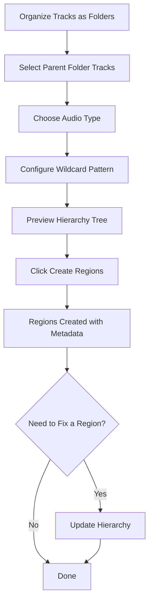
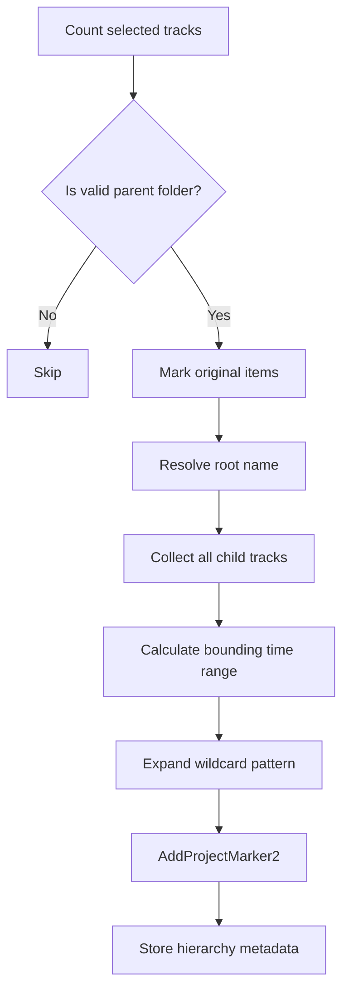

# 🎚️ Region Creator v1.0 - Hierarchical Region Generation for REAPER

**Automated region creation from track folder structure with per-type wildcard naming and persistent settings**


## 🚀 Key Features
- **Wildcard Naming**: Flexible token-based region naming per audio type
- **Audio Type System**: Separate configurations for SFX, Music, Dialogue, and Environment
- **Hierarchy Tree View**: Live preview of selected track structure before creating regions
- **Persistent Settings**: All configurations saved between sessions via REAPER ExtState
- **Multi-file Architecture**: Modular codebase split into focused, maintainable modules

## ⚡ Quick Start Guide

### 1. Installation
```
1. Copy the "Region Creator/" folder to your REAPER Scripts directory
2. In REAPER: Actions > Load ReaScript > select RegionCreator.lua
3. Optionally assign a keyboard shortcut or toolbar button
```

### Prerequisites
- REAPER 6.0 or higher
- [Lokasenna_GUI v2](https://github.com/jalovatt/Lokasenna_GUI) — run the library path setter from:
  `Scripts > ReaTeam Scripts > Development > Lokasenna_GUI v2 > Library > Set Lokasenna_GUI v2 library path.lua`

### 2. Core Workflow


## 🖥️ GUI Overview

The interface is 460 × 420 px and organized into three tabs:

| Tab | Purpose |
|-----|---------|
| **Main** | Select audio type, preview track hierarchy, create regions |
| **Settings** | Edit wildcard pattern and type-specific parameters |
| **Audio Types** | Manage prefix and pattern for all four types |

---

## 🛠️ Button Reference

### 🔨 Core Tools
| Button | Function | Usage |
|--------|----------|-------|
| **Create Regions** | Scans selected folder tracks and creates named regions | Select parent folders first, then click |
| **Update Hierarchy** | Manually reassign root/parent metadata on an existing region | Place cursor inside the region, then click |

---

## 🎚️ Audio Type Configuration

Four types are built in, each with its own prefix and wildcard pattern:

| Type | Prefix | Default Pattern |
|------|--------|-----------------|
| **SFX** | `sx` | `$prefix_$root_$parent_` |
| **Music** | `mx` | `$prefix_$root_$parent_$bpm_$meter_` |
| **Dialogue** | `dx` | `$prefix_$character_$questtype_$questname_$line_` |
| **Environment** | `env` | `$prefix_$root_$parent_` |

Each type stores its own config independently. Switching types in the UI loads that type's settings.

---

## 🌟 Wildcard Tokens

Use these tokens in the Pattern field on the Settings tab:

| Token | Expands To | Relevant Type |
|-------|-----------|---------------|
| `$prefix` | Type prefix (`sx`, `mx`, `dx`, `env`) | All |
| `$root` | Root folder name or project filename | All |
| `$parent` | Selected parent folder name | All |
| `$bpm` | BPM value | Music |
| `$meter` | Meter string e.g. `4-4` | Music |
| `$character` | Character name | Dialogue |
| `$questtype` | Quest type e.g. `SQ`, `MQ` | Dialogue |
| `$questname` | Quest name — falls back to `$parent` if empty | Dialogue |
| `$line` | Zero-padded line number `01`, `02 ...` | Dialogue |
| `$region` | Alias for `$parent` (legacy) | All |

### Example Outputs
```
SFX:         sx_Weapons_Pistol_
Music:        mx_OST_MainTheme_120_4-4_
Dialogue:     dx_merchant_SQ_tutorial_welcome_01_
Environment:  env_Ambient_Jungle_
```

---

## 🔍 How Region Creation Works



### Track Structure Expected
```
Root folder  (or Project)
└── Parent folder  ← select this track
    ├── Child track  [media items]
    ├── Child track  [media items]
    └── ...
```

A valid parent folder must have `I_FOLDERDEPTH == 1` and at least one child track containing media items. If no grandparent exists, the project filename is used as the root name.

---

## 🗂️ File Structure

```
Region Creator/
├── RegionCreator.lua       # Controller — REAPER action entry point
└── src/
    ├── config.lua          # Defaults: audio types, settings constants
    ├── audio_types.lua     # Audio type CRUD + sync helpers
    ├── settings.lua        # State initialization from ExtState
    ├── track_utils.lua     # Track traversal utilities
    ├── wildcards.lua       # Wildcard token expansion
    ├── regions.lua         # Region creation + hierarchy management
    └── gui.lua             # Lokasenna UI + gui_start()
```

All modules share a single global namespace table `RC`. `RegionCreator.lua` initializes it as `RC = {}` and loads each module sequentially via `loadfile`.

---

## 📊 Hierarchy Tree View

The Main tab shows a live preview of the selected track's context, updated every frame:

```
Root   WeaponsSFX
  └── Pistol
      ├── Shoot   [4 items]
      └── Reload   [2 items]
```

If the selected track has more than 3 child tracks with items, the tree shows the first 3 and a `... N more` indicator.

---

## 💾 Persistence

All settings are stored in REAPER ExtState under the key `SFX_Renderer` and survive project close and REAPER restart.

| ExtState Key | Description |
|--------------|-------------|
| `audio_type_count` | Number of audio types |
| `audio_type_N` | Serialized audio type N (name, prefix, pattern, config) |
| `wildcard_template` | Last active wildcard pattern |
| `music_bpm` / `music_meter` | Music type parameters |
| `dx_character` / `dx_quest_type` / `dx_quest_name` / `dx_line_number` | Dialogue parameters |

---

## 💡 Pro Tips

1. **Type-specific patterns**: Each audio type remembers its own pattern — switch types freely without losing settings.
2. **Root fallback**: If your parent folder has no grandparent, the project filename becomes the root automatically.
3. **Dialogue line numbers**: `$line` is always zero-padded (`01`, `02`...) — no manual formatting needed.
4. **Partial quest names**: Leave `$questname` blank and it will automatically fall back to the folder name (`$parent`).
5. **Audio Types tab**: Edit all prefixes and patterns in one place, then click Save — changes apply immediately.

---

## 🐛 Troubleshooting

| Symptom | Solution |
|---------|----------|
| Script fails to open | Run the Lokasenna_GUI v2 library path setter and try again |
| No regions created | Verify selected tracks are parent folders with child tracks containing media items |
| Region name looks wrong | Check the wildcard pattern in the Settings tab for the active audio type |
| Settings reset after update | Settings persist per machine via ExtState — re-enter once after a full reset |
| Hierarchy shows wrong root | Use "Update Hierarchy" to manually reassign root/parent for that region |

---

## 🌐 Use Cases

| Scenario | Solution | Benefit |
|----------|----------|---------|
| **SFX library batch naming** | SFX type with `$prefix_$root_$parent_` | Consistent naming across all assets |
| **Music stems** | Music type with BPM and meter tokens | Filename encodes tempo metadata |
| **VO line batches** | Dialogue type with character + quest tokens | Per-character subfolder-ready names |
| **Ambient beds** | Environment type | Separate prefix keeps ambiences organized |

---

**Version**: 1.0
**Author**: Daniel "Panchuel" Montoya
**Compatibility**: REAPER 6.0+ · Lokasenna_GUI v2
**Last Updated**: 2025
